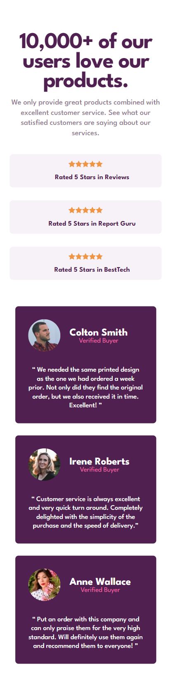
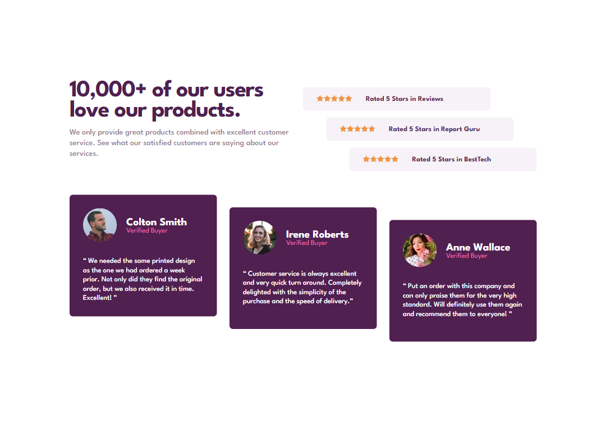

# Frontend Mentor - Social proof section solution

This is a solution to the [Social proof section challenge on Frontend Mentor](https://www.frontendmentor.io/challenges/social-proof-section-6e0qTv_bA). Frontend Mentor challenges help you improve your coding skills by building realistic projects.

## Table of contents

-   [Overview](#overview)
    -   [The challenge](#the-challenge)
    -   [Screenshot](#screenshot)
    -   [Links](#links)
-   [My process](#my-process)
    -   [Built with](#built-with)
-   [Author](#author)
-   [Acknowledgments](#acknowledgments)

**Note: Delete this note and update the table of contents based on what sections you keep.**

## Overview

### The challenge

Users should be able to:

-   View the optimal layout for the section depending on their device's screen size

### Screenshot

Mobile

Desktop

### Links

-   Solution URL: [Add solution URL here](https://your-solution-url.com)
-   Live Site URL: [Add live site URL here](https://your-live-site-url.com)

## My process

### Built with

-   Semantic HTML5 markup
-   CSS custom properties
-   Flexbox
-   CSS Grid
-   Mobile-first workflow
-   [React](https://reactjs.org/) - JS library

## Author

-   Github - [NataJenkins](https://github.com/NataJenkins)
-   Frontend Mentor - [@NataJenkins](https://www.frontendmentor.io/profile/NataJenkins)
-   Linkedin - [natalia0896](https://www.linkedin.com/in/natalia0896/)
